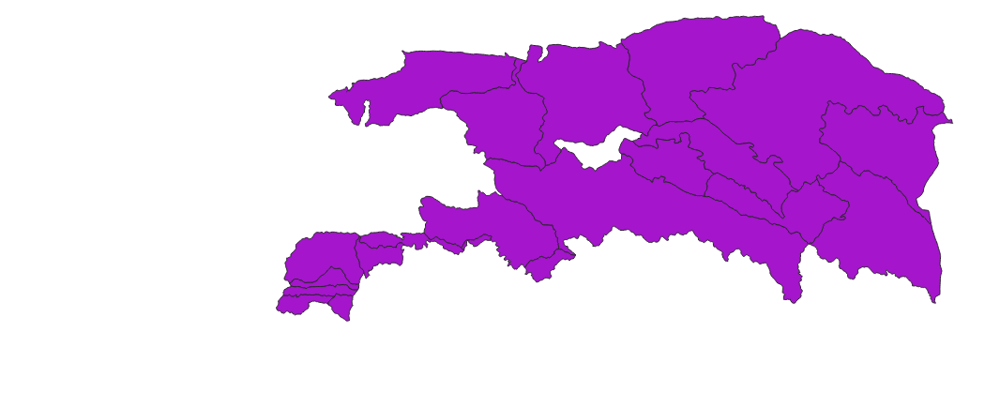
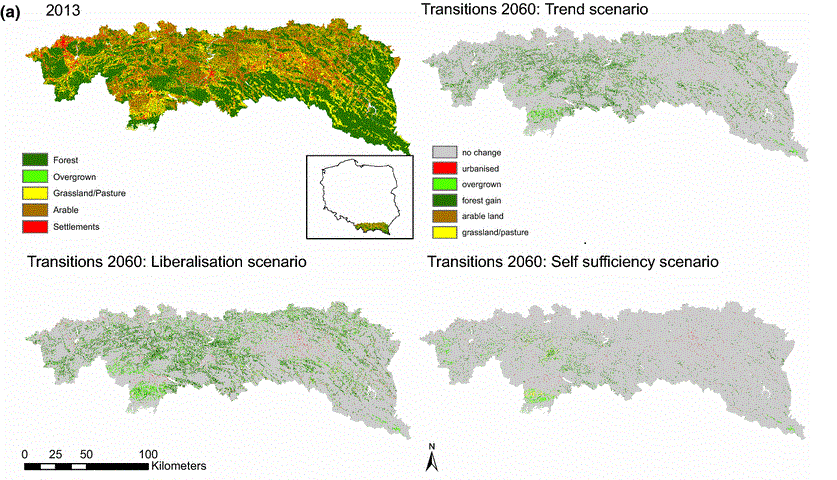
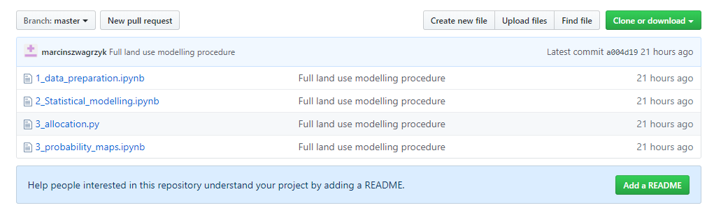

## Visualisation
I came to PHD School with a problem - I even presented it on monday- how to visualize hundreds of modelling areas, and results for thos units. The problem is that those aras are aggregation of basic units - like communes - and it is hard to show them at once (they overlay each other).

On Tuesday we had a workshop with Topi Tjukanov and I liked vey much two things Topi showed us:

QGIS blending styles helped me to some extent to display features that overlay each other

Time Manager also is very nice to show the quantity of modelling areas:

I have still some ideas about visualisazing trajectories in spatial units and I will
still look for a nice way hw to do it

## Rproducibility
On Wednesday we ahd a workshop about reporducility: version control, repositories etc..

During my Phd I used the same set of input data that  was  described in a paper I am a co-author:

It was a simple dataset: one land cover map and 12 explanatory variables maps.
Data from this paper was meant to be make public. So I think there will be no problem to put it into repository.

And as I mentioned befeore - I used hundreds of modelling areas, but they were generated automatically from just 3 sets of basic units:
administrative, physical and geometrical spatial units

Generating of modelling areas as well as my whole modelling procedure was coded by me in Python 
with using of diffrent libtraries (like ArPy, pandas, scikit learn)

All of this code I uploaded already (yesterday and today) on my GitHUB repository
[my repository](https://github.com/marcinszwagrzyk/LandUse_MAUP_model)

But the code is very unclean and need to be polished, before being ready to be reused by somebody else on diffrent data.

## Science Communication
At General, the readers of my work will be the people who work with land use models. So, there are mostly geographers. The benefit they will get from reading my work is that they will have a guideline how to proceed with land use modelling

But my Phd thesis has one disadavntage: it is in Polish. So the audience is now very limited.
Writing a paper in English will be much better.